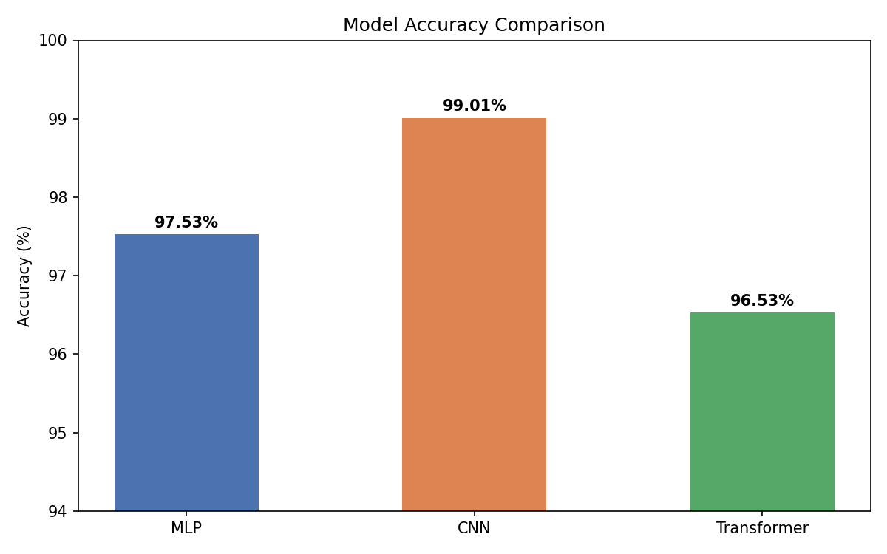
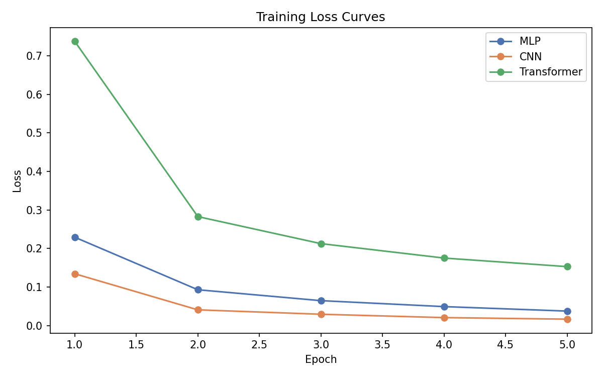

# AI-HW-FALL-2026-NN

Assignment #4.1 — MNIST Handwritten Digit Recognition using Neural Networks

## Objective

Compare three different neural network architectures — MLP, CNN, and Transformer — on the same image recognition task (MNIST handwritten digits) to understand how architecture choices affect accuracy and training behavior.

## Overview

Three neural networks trained and tested on the MNIST dataset:

- **MLP** (Multi-Layer Perceptron) — baseline fully connected network
- **CNN** (Convolutional Neural Network) — designed for image data
- **Transformer Encoder** — patch-based attention model

## Results

| Model       | Accuracy |
|-------------|----------|
| MLP         | 97.53%   |
| CNN         | 99.01%   |
| Transformer | 96.53%   |

## Project Structure

    models/
        mlp.py
        cnn.py
        transformer.py
    results/
        results.txt
        loss_history.json
        bar_chart.png
        loss_curves.png
        confusion_mlp.png
        confusion_cnn.png
        confusion_transformer.png
    train.py
    test.py
    visualize.py
    README.md

## Visualizations

## Requirements

- Python 3
- PyTorch
- torchvision
- matplotlib
- numpy

Install with:

    pip3 install torch torchvision matplotlib numpy

## How to Run

Train all models:

    python3 train.py

Test all models:

    python3 test.py

Generate visualizations:

    python3 visualize.py